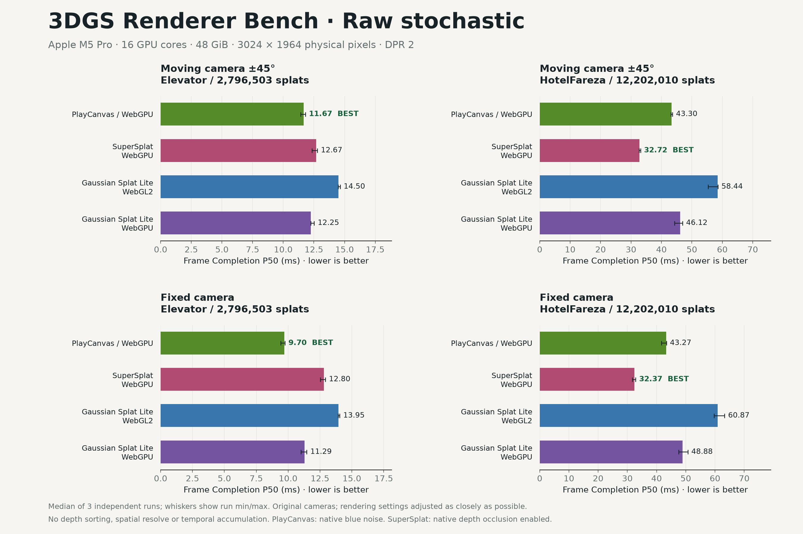
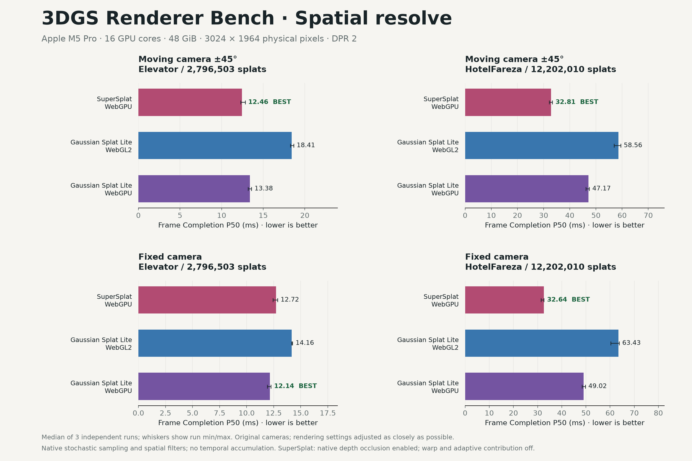

# 3DGS Renderer Bench

Measured comparisons of [Spark](https://github.com/sparkjsdev/spark), [PlayCanvas Engine](https://github.com/playcanvas/engine), [SuperSplat](https://github.com/playcanvas/supersplat), and [Gaussian Splat Lite](https://github.com/WilliamLiu-1997/Gaussian-Splat-Lite).

[Benchmark website](https://3dgs-renderer-bench.vercel.app) · [Interactive local report](3DGS-Renderer-Bench.html)






## What was measured

- Spark 2.2.0 / WebGL2, with extended source data and accumulator.
- **PlayCanvas Engine 2.23.0-beta.20 / WebGL2 and WebGPU**, using `dataFormat: 'large'` on both.
- **SuperSplat 3.4.2 / WebGPU**, using PlayCanvas beta.20, with ordinary sorting, raw stochastic rendering and native spatial resolve. Native stochastic depth occlusion uses its default enabled setting; motion-adaptive contribution culling and warp are disabled.
- Gaussian Splat Lite 1.1.5 / WebGL2 and WebGPU, with default sorting only. Three.js 0.186.1.
- Rendering settings across all six backends are adjusted as closely as possible: camera-axis sorting, aligned size thresholds, blur and alpha. Native projection, culling and sorting details still differ.
- Elevator: 2,796,503 splats. HotelFareza: 12,202,010 splats. Full original PLY inputs with SH3, unchanged published cameras, no generated LOD hierarchy.
- MacBook Pro 14, Apple M5 Pro (16 GPU cores), 48 GiB unified memory, macOS 26.7, Chrome 153. Canvas: 1512 × 982 CSS pixels, DPR 2, **3024 × 1964 physical pixels**.
- Three independent runs per model/backend: **36 runs and 192 performance groups**. All backends measure static main, close side and moving main views (±45° orbit amplitude, matching the lab). Raw stochastic transparency compares PlayCanvas WebGPU (native blue noise) with SuperSplat and both GSL backends in static and moving views. SuperSplat and GSL spatial resolve form a separate comparison. Temporal accumulation is off.

Frame completion includes CPU submission, GPU completion and timestamp-query readback with one frame in flight; it is not display FPS. The report presents Frame Completion P50 and P95. Sorting latency, combined JS heap + ArrayBuffer + WASM and explicit GPU allocation are separately defined in [the measurement guide](harness/README.md). Adjusting rendering settings does not remove instrumentation overhead or guarantee pixel-identical images.

## View the results

Open `3DGS-Renderer-Bench.html`. It includes English/Chinese controls, per-round comparisons and embedded screenshot previews. Original captures link to `harness/results`. No model files are required to read the report.

`benchmark-data.json` and `benchmark-summary.csv` contain summary measurements; `validation.json` records the completed checks. `harness/results` contains 36 raw run JSON files and their captures. The gallery uses 26 round-one captures. The former SuperSplat results are retained in git history and the [historical v1.0.0 kit](https://github.com/WilliamLiu-1997/3dgs-renderer-bench/releases/download/v1.0.0/renderer-benchmark-kit.zip); that release is a different protocol.

## Test your own model

Open the [browser lab](https://3dgs-renderer-bench.vercel.app/test/) to compare Spark, PlayCanvas and GSL across five backends on a PLY or SPZ. Drop a local file or enter a direct HTTP(S) `.ply`/`.spz` URL with CORS enabled. Files stay in the browser; SPZ is converted to a shared PLY before testing. Downloads happen once, before renderer loading, and are timed separately.

Choose versions, camera, resolution and sampling settings; run sequentially and export JSON/PDF with screenshots. Rendering settings are adjusted as closely as possible in both tools. Lab Frame P50/P95 measure completion without the report's GPU-query readback instrumentation, so absolute times are not directly interchangeable.

With Node.js 22 or 24:

```sh
npm ci
npm run dev
# Open the printed URL (default: http://127.0.0.1:5349/test/).
```

Restart after source changes. WebGPU requires HTTPS or localhost and a supported browser/GPU. See the [lab guide](lab/README.md).

## Reproduce the measurements

Requires local Google Chrome with native WebGPU and timestamp queries. Process-memory diagnostics use Unix `ps`.

1. Place `Elevator.ply` and `HotelFareza.ply` in `models/`, or edit `harness/config.json` paths. Verify the hashes in `input-manifest.json`.
2. Run:

```sh
cd harness
npm ci
npm run build
npm run pilot
mv results results-original
npm run bench
```

Completed results with the current protocol are skipped. New data goes to `harness/results`. The runner manages its own server on port 5351, configurable through `PORT`.

Backend IDs are `spark`, `pc-gl`, `pc-gpu`, `supersplat`, `gsl-gl`, `gsl-gpu`. For example, `node run.mjs hotel pc-gl pc-gpu`; `ROUNDS=1` selects a diagnostic round. Full validation expects three rounds across both models and all six backends.

## Regenerate the report

From the repository root:

```sh
python3 -m venv .venv
.venv/bin/pip install -r tools/requirements.txt
.venv/bin/python tools/analyze.py
.venv/bin/python tools/plot.py
.venv/bin/python tools/validate.py
```

Generated files go to `outputs/`. When updating the root snapshot, copy the HTML, JSON, CSV, all three chart PNG/SVG pairs and validation together, and point original-image paths at `harness/results/`. Update `input-manifest.json` with the matching protocol and versions.

## Build the website

```sh
npm run build
```

Builds the report, its current original captures, and `/test/` into `site/`. Models and the instrumented harness are not deployed. `vercel.json` configures the build with no required environment variables.

## License

Benchmark code is MIT licensed. Renderer code retains its licenses in `licenses/`. SuperSplat source is retained under `vendor/supersplat/LICENSE` and is used by the instrumented report adapter; the browser lab remains on public Engine APIs.
