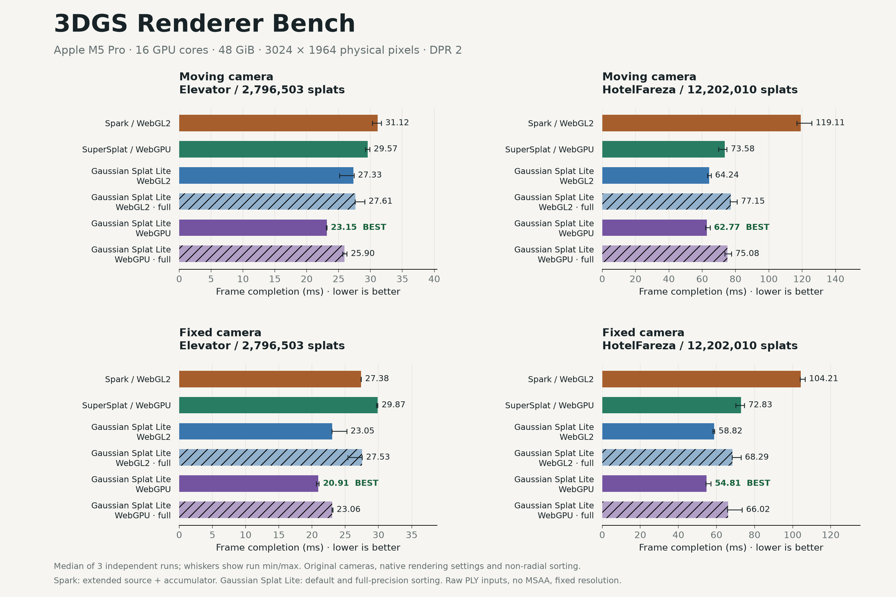

# 3DGS Renderer Bench

Measured comparisons of [Spark](https://github.com/sparkjsdev/spark), [SuperSplat](https://github.com/playcanvas/supersplat), and [Gaussian Splat Lite](https://github.com/WilliamLiu-1997/Gaussian-Splat-Lite).

[View the live benchmark](https://3dgs-renderer-bench.vercel.app) · [Download the reproduction kit](https://github.com/WilliamLiu-1997/3dgs-renderer-bench/releases/download/v1.0.0/renderer-benchmark-kit.zip)



## What was measured

- Spark 2.2.0 / WebGL2, using native rendering defaults, non-radial sorting, and the requested extended source data and extended accumulator.
- SuperSplat Editor 3.4.2 / native WebGPU, using its original renderer, GPU sorter, and native rendering defaults.
- Gaussian Splat Lite 1.1.5 / WebGL2 and native WebGPU, with default and full-precision sorting.
- Elevator: 2,796,503 splats. HotelFareza: 12,202,010 splats. Full source inputs, unchanged published cameras, SH3, and fixed resolution. The raw PLY files contain no LOD hierarchy.
- MacBook Pro 14, Apple M5 Pro (16 GPU cores), 48 GiB unified memory, macOS 26.7, Chrome 153. Canvas: 1512 × 982 CSS pixels, DPR 2, 3024 × 1964 physical pixels.
- Three independent runs per model/backend: 24 runs and 180 performance groups. Normal sorting, camera motion, stochastic transparency, and spatial resolve are covered where supported.

Renderers use their default rendering parameters and camera-axis depth sorting. SuperSplat stochastic rendering enables occlusion culling; it is lossy, but delivers a substantial performance improvement in large scenes.

Frame completion includes submission, GPU completion and query readback with one frame in flight; it is not display FPS. GPU timings, sorting latency and memory have separate definitions in [the measurement guide](harness/README.md). Spatial resolve has temporal accumulation disabled.

## View the results

Download and extract the [reproduction kit](https://github.com/WilliamLiu-1997/3dgs-renderer-bench/releases/download/v1.0.0/renderer-benchmark-kit.zip), then open `3DGS-Renderer-Bench.html`. It includes the interactive report and original captures. You do not need the PLY files to view the results.

`benchmark-data.json` and `benchmark-summary.csv` contain the summary data. `harness/results` contains 24 original run JSON files and 24 original captures. Only local model paths were replaced with portable paths; measured values are unchanged.

## Test your own model

Open the [browser lab](https://3dgs-renderer-bench.vercel.app/test/) to compare Spark, PlayCanvas Engine, and Gaussian Splat Lite with your own PLY or SPZ. Drop a local file or enter a direct HTTP(S) model URL ending in `.ply` or `.spz` (query parameters are supported). Remote servers must allow CORS. Files are processed in your browser; SPZ is converted to a shared PLY before testing. URL downloads happen once, before renderer loading, and their duration is recorded separately in JSON.

Choose renderer versions, camera, resolution and sampling settings, then run backends sequentially and export JSON or PDF reports with screenshots. The lab uses fixed matched presets; native rendering and sorting differences can still affect image quality. PlayCanvas Engine results are separate from the historical SuperSplat Editor results.

**Frame P50/P95 measure frame completion time**, including CPU submission, GPU work and synchronization with one frame in flight. They are not isolated GPU timings or display FPS. Load and SPZ conversion times are reported separately.

To run locally with Node.js 22 or 24:

```sh
npm ci
npm run dev
# Open the URL printed in the terminal (default: http://127.0.0.1:5349/test/).
```

Restart after source changes. WebGPU requires HTTPS or localhost and a supported browser/GPU. See the [lab guide](lab/README.md) for rendering presets, version selection, timing details and compatibility.

## Reproduce the measurements

The harness was validated on macOS with Node.js 20+ and locally installed Google Chrome. Its process-memory diagnostic uses the Unix `ps` command. Native WebGPU and GPU timestamp queries must be available.

1. Clone this repository or extract the reproduction kit.
2. Place `Elevator.ply` and `HotelFareza.ply` in `models/`, or edit their paths in `harness/config.json`. Match the hashes in `input-manifest.json` for the same inputs.
3. From the repository root:

```sh
cd harness
npm ci
npm run build
npm run pilot
mv results results-original
npm run bench
```

The provided results are renamed before a fresh measurement because completed runs are skipped. New raw data and screenshots are written to `harness/results`. The runner starts and stops its own localhost server; do not run `npm start` at the same time. The original model files are not included or uploaded.

For one model/backend, run `node run.mjs hotel gsl-gpu` from `harness/`. Backend IDs are `spark`, `supersplat`, `gsl-gl` (Gaussian Splat Lite WebGL2), and `gsl-gpu` (Gaussian Splat Lite WebGPU). `ROUNDS=1` is available for a short diagnostic; the full validation expects three rounds across both models and all four backends.

## Regenerate the report

From the repository root, after measurements are complete:

```sh
python3 -m venv .venv
.venv/bin/pip install -r tools/requirements.txt
.venv/bin/python tools/analyze.py
.venv/bin/python tools/plot.py
.venv/bin/python tools/validate.py
```

Generated files go to `outputs/`. The root HTML remains the published snapshot. If you publish new measurements, update the snapshot, hardware description, screenshots and release assets together.

## Build and deploy the website

```sh
npm run build
```

Builds the historical report and `/test/` lab into `site/`. Models and the instrumented harness are not deployed.

Import the repository into Vercel; `vercel.json` configures the build with no required environment variables. Release links are configured in `tools/build-site.mjs`; optional `BENCHMARK_REVISION` pins original-image links to a commit instead of the release tag.

## License

Benchmark code is MIT licensed. Bundled renderer code retains its original licenses and notices in `licenses/` and `vendor/supersplat/LICENSE`.
